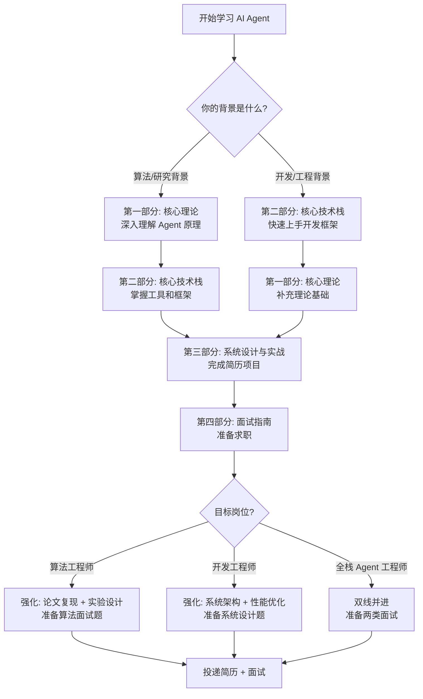

# AgentGuide


<div align="center">
    
    
    
    
<br/>
    
<a href="https://github.com/adongwanai/AgentGuide">
        
    </a>
    <a href="https://github.com/adongwanai/AgentGuide/network/members">
        
    </a>
    
<br/>
    
<h2>🔥 AI Agent 开发 × 面试求职 = 一站式解决方案</h2>
    
<p>
        <strong>一站式 AI Agent 学习指南</strong><br/>
        <strong>从入门到拿 Offer，系统化 + 实战化 + 求职导向</strong>
    </p>
    
<p>
        <a href="#-快速开始"><strong>🚀 10分钟快速上手</strong></a> •
        <a href="#-目录结构"><strong>📚 完整学习路线</strong></a> •
        <a href="#-实战项目"><strong>💼 简历级项目</strong></a> •
        <a href="#-联系作者"><strong>💬 加入学习社群</strong></a>
    </p>
</div>

---

## 📖 关于本项目

> **3 分钟了解为什么你需要 AgentGuide**

### 😰 你是否正在经历这些痛点？

- ❌ **学了一堆 LLM API 调用，但不知道 Agent 和普通对话有什么区别**
- ❌ **看了无数篇 LangChain 文档，却依然不知道从哪里开始**
- ❌ **做了一些 Demo 项目，但简历上写不出亮点，面试讲不清楚**
- ❌ **想转 AI Agent 方向，但不知道算法岗和开发岗应该准备什么**
- ❌ **网上资料又多又杂，缺少一条清晰的学习路线**

### 💡 为什么选择 AgentGuide？

**在大模型时代，AI Agent 正在成为最具商业价值的技术方向：**

| 维度          | 数据/事实                                         |
| :---------- | :-------------------------------------------- |
| 📈 **市场需求** | 2025年春招，Agent 相关岗位同比增长 **300%+**（数据来源：Boss直聘） |
| 💰 **薪资水平** | Agent 算法工程师平均年薪 **40-100万**，高于传统 NLP/CV 岗位    |
| 🚀 **技术门槛** | **个人可玩转**：一台笔记本 + API 即可开发(算法需要GPU资源)         |
| 🎯 **岗位类型** | **算法岗 + 开发岗双通道**，既可以做创新研究，也可以做工程落地            |
| 🔥 **应用场景** | 智能客服、代码生成、数据分析、研究助手、自动化运维...无处不在              |

**然而，现状是：**
- 📚 **学术论文太多**：ReAct、Reflexion、AutoGPT...论文堆砌，缺少工程实践
- 🧩 **资料过于零散**：LangChain 文档、YouTube 教程、知乎文章...碎片化学习效率低
- ❓ **没有求职导向**：学完了技术，但不知道面试怎么考、简历怎么写

**`AgentGuide` 的定位：**

> **AI Agent 领域的 "JavaGuide"**  
> 系统化、工程化、求职导向的 Agent 学习与面试指南  
> 让每一个想转 Agent 方向的同学，都能找到清晰的成长路径

### 🎯 这份指南适合谁？

- ✅ **算法工程师**：想要将论文里的 Agent 思想落地成可用系统
- ✅ **后端/全栈工程师**：想要转型 AI 赛道，掌握 Agent 开发技能
- ✅ **在校学生**：准备春招/秋招，希望系统准备 AI Agent 相关岗位
- ✅ **AI 爱好者**：想要深入理解 LangChain、LangChain、高级RAG 等核心技术
- ✅ **"通吃"型选手**：既想做算法创新，又想做工程落地的全栈 AI 同学


### 🌟 AgentGuide 的 6 大核心价值

<table>
<tr>
<td width="50%">
📚 系统化学习路径

- ✅ 从零基础到面试通过的完整路线
- ✅ 理论 → 工具 → 实战 → 求职，环环相扣
- ✅ 不用再到处找资料，一个仓库学完全部
</td>
<td width="50%">
 🎯 100% 求职导向
 
- ✅ 每个知识点都标注"面试怎么考"
- ✅ 提供真实大厂面试题
- ✅ 手把手教你如何将项目写进简历
</td>
</tr>
<tr>
<td>
💼 n个简历级实战项目

- ✅ XXXAgent（RAG方向）
- ✅ XXXMulti-Agent（协作方向）
- ✅ XXXAgent（高级方向）
- ✅ 每个项目提供算法岗和开发岗两种写法
</td>
<td>
🔀 算法 × 开发双线通吃

- ✅ 同一项目，可投算法岗或开发岗
- ✅ 算法线：原理、创新、实验设计
- ✅ 开发线：架构、优化、系统设计
</td>
</tr>
<tr>
<td>
🆓 完全开源，持续更新

- ✅ 所有内容永久免费
- ✅ 作者一线大模型算法工程师
- ✅ 社区驱动，欢迎贡献
</td>
<td>
🚀 快速上手，立即见效

- ✅ 10 分钟跑通第一个 Agent
- ✅ 2-3 周完成简历级项目
- ✅ 6-8 周系统掌握，准备面试
</td>
</tr>
</table>

---


### 🎁 学完 AgentGuide，你能获得什么？

> **从迷茫到清晰，从理论到Offer，一站式成长路径**

```
✅ 【概念清晰】深刻理解：Agent 和普通 LLM 调用的本质区别
✅ 【技能掌握】熟练使用：LangChain、Langchain、向量数据库等核心工具  
✅ 【动手能力】独立开发：RAG Agent、Multi-Agent、Web Agent 系统
✅ 【简历亮点】2-3 个可以写进简历、面试能讲清楚的项目
✅ 【面试自信】掌握 Agent 方向的高频面试题和标准答案
✅ 【职业规划】明确算法岗和开发岗的差异，找到适合自己的方向
✅ 【人脉资源】加入 AI Agent 学习社群，结识同行，互相成长
```

---

## 🗺️ 学习路线图



### ⏱️ 学习时间规划

- **🚀 快速通道（2-3 周）**：适合有 AI 基础，想快速上手 Agent 开发的同学
  - Week 1: 第一部分 1.1-1.2 + 第二部分 2.2
  - Week 2: 第三部分实战项目（选一个）
  - Week 3: 第四部分面试准备

- **📚 系统学习（6-8 周）**：适合零基础或想深入掌握的同学
  - Week 1-2: 第一部分（理论基础）
  - Week 3-4: 第二部分（技术栈）
  - Week 5-6: 第三部分（完成 2-3 个项目）
  - Week 7-8: 第四部分（面试冲刺）

---

## 📚 目录结构

### 📖 第一部分：AI Agent 核心理论（基石篇）

> 💡 **学习目标**：理解 Agent 的本质，掌握主流架构思想，建立理论基础

#### 1.1 Agent 基础概念入门
- [ ] [必看👍 到底什么是 AI Agent？图文详解](./docs/01-theory/01-what-is-agent.md)
- [ ] [核心组件详解：Planning、Memory、Tool Use](./docs/01-theory/02-core-components.md)
- [ ] [Agent 与 RAG 的关系](./docs/01-theory/03-agent-vs-rag.md)

#### 1.2 主流 Agent 架构思想
- [ ] [必看👍 ReAct 框架思想详解](./docs/01-theory/04-react-framework.md)
- [ ] [思维链 (Chain-of-Thought, CoT) 与 Agent 规划](./docs/01-theory/05-cot-and-planning.md)
- [ ] [高阶架构：Tree of Thoughts, Self-Correction, Self-Consistency](./docs/01-theory/06-advanced-architectures.md)
- [ ] [多智能体系统 (Multi-Agent) 入门](./docs/01-theory/07-multi-agent-intro.md)

#### 1.3 Agent 评估与基准
- [ ] [AgentBench：主流 Agent 评测框架介绍](./docs/01-theory/08-agent-bench.md)
- [ ] [如何科学评估 Agent 性能？](./docs/01-theory/09-evaluation-metrics.md)

---

### 🛠️ 第二部分：核心技术栈与框架（工具篇）

> 💡 **学习目标**：掌握 Agent 开发的核心工具链，能够快速搭建原型系统

#### 2.1 大语言模型 (LLMs) - Agent 的大脑
- [ ] [主流 LLM API 对比与选型](./docs/02-tech-stack/01-llm-api-comparison.md)
- [ ] [开源 LLM 本地部署与调用](./docs/02-tech-stack/02-open-source-llm.md)
- [ ] [Fine-tuning 入门：什么时候需要微调？](./docs/02-tech-stack/03-llm-finetuning.md)

#### 2.2 Agent 开发框架（必看👍）
- [ ] [必看👍 LangChain 核心概念与实战](./docs/02-tech-stack/04-langchain-guide.md)
- [ ] [LlamaIndex 核心概念与实战](./docs/02-tech-stack/05-llamaindex-guide.md)
- [ ] [AutoGen/CrewAI 多智能体框架详解](./docs/02-tech-stack/06-multi-agent-frameworks.md)
- [ ] [框架选型对比：何时用 LangChain vs LlamaIndex](./docs/02-tech-stack/07-framework-comparison.md)

#### 2.3 向量数据库 - Agent 的记忆
- [ ] [必看👍 向量数据库基础：Embedding 与向量检索](./docs/02-tech-stack/08-vector-db-basics.md)
- [ ] [主流向量数据库对比与实战](./docs/02-tech-stack/09-vector-db-comparison.md)
- [ ] [RAG 检索策略详解：从基础到 HyDE、Rerank、Query Expansion](./docs/02-tech-stack/10-rag-strategies.md)

#### 2.4 工具 (Tools) - Agent 的双手
- [ ] [API 工具：让 Agent 调用外部服务](./docs/02-tech-stack/11-api-tools.md)
- [ ] [代码解释器 (Code Interpreter)：原理与实现](./docs/02-tech-stack/12-code-interpreter.md)
- [ ] [网络浏览 (Web Browsing)：原理与实现](./docs/02-tech-stack/13-web-browsing.md)

---

### 🚀 第三部分：系统设计与实战（应用篇）

> 💡 **学习目标**：从玩具到产品，掌握生产级 Agent 系统设计，完成可写进简历的项目

#### 3.1 Agent 系统设计
- [ ] [必看👍 Agent 系统设计面试题总结](./docs/03-practice/01-system-design-interview.md)
- [ ] [如何设计一个高可用的 RAG 系统？](./docs/03-practice/02-high-availability-rag.md)
- [ ] [Agent 安全性：Prompt 注入、权限控制、数据隐私](./docs/03-practice/03-agent-security.md)
- [ ] [Agent 可观测性：监控、调试与追踪](./docs/03-practice/04-observability.md)

#### 3.2 简历级实战项目 🚀

> **每个项目都提供完整代码 + 算法岗/开发岗双版本简历写法**

<details>
<summary><b>📄 项目一：自动化论文检索与分析 Agent（⭐ 推荐新手）</b></summary>

<br/>

**适合场景**：面试 RAG 相关岗位，展示检索增强能力

**技术栈**：LangChain + Milvus + ArXiv API + GPT-4

**项目亮点**：
- ✅ 实现 Agentic RAG 策略（自主规划检索步骤）
- ✅ 动态查询重写 + 多跳推理
- ✅ LangSmith 可观测性集成

**学习内容**：
- [ ] [项目需求与技术选型](./projects/01-paper-agent/01-requirements.md)
- [ ] [系统架构设计](./projects/01-paper-agent/02-architecture.md)
- [ ] [核心代码实现](./projects/01-paper-agent/03-implementation.md)
- [ ] [部署与演示](./projects/01-paper-agent/04-deployment.md)
- [ ] [📝 如何写进简历？（算法岗 vs 开发岗）](./projects/01-paper-agent/05-resume-guide.md)

**简历示例（算法岗）**：
> 【Agentic RAG 策略优化】设计基于 ReAct 框架的论文检索 Agent，通过自主规划和多跳推理，将召回准确率从 65% 提升至 85%...

**简历示例（开发岗）**：
> 【高可用论文分析系统】端到端搭建论文检索 Agent，引入 Redis 缓存降低 70% API 调用成本，LangSmith 链路追踪使问题定位效率提升 5 倍...

</details>

<details>
<summary><b>🌍 项目二：旅行规划 Multi-Agent 系统（⭐ 适合展示协作能力）</b></summary>

<br/>

**适合场景**：面试 Multi-Agent 岗位，展示多智能体协作设计

**技术栈**：AutoGen / CrewAI + 多个 API（天气、航班、酒店）

**项目亮点**：
- ✅ 3 个 Agent 分工协作（规划师、预算师、执行者）
- ✅ 层级式通信机制
- ✅ 冲突解决与共识机制

**学习内容**：
- [ ] [项目需求与技术选型](./projects/02-travel-agent/01-requirements.md)
- [ ] [系统架构设计](./projects/02-travel-agent/02-architecture.md)
- [ ] [核心代码实现](./projects/02-travel-agent/03-implementation.md)
- [ ] [部署与演示](./projects/02-travel-agent/04-deployment.md)
- [ ] [📝 如何写进简历？（算法岗 vs 开发岗）](./projects/02-travel-agent/05-resume-guide.md)

</details>

<details>
<summary><b>🕷️ 项目三：Web Agent - 自主浏览与任务完成（⭐ 高级，适合冲刺大厂）</b></summary>

<br/>

**适合场景**：面试高级 Agent 岗位，展示复杂场景处理能力

**技术栈**：Playwright + GPT-4V + 强化学习

**项目亮点**：
- ✅ 视觉理解 + 操作执行闭环
- ✅ 自我修正机制（错误重试）
- ✅ 在 WebArena 基准测试上超过 Baseline

**学习内容**：
- [ ] [项目需求与技术选型](./projects/03-web-agent/01-requirements.md)
- [ ] [系统架构设计](./projects/03-web-agent/02-architecture.md)
- [ ] [核心代码实现](./projects/03-web-agent/03-implementation.md)
- [ ] [部署与演示](./projects/03-web-agent/04-deployment.md)
- [ ] [📝 如何写进简历？（算法岗 vs 开发岗）](./projects/03-web-agent/05-resume-guide.md)

</details>

---

### 💼 第四部分：面试指南（求职篇）

> 💡 **学习目标**：系统准备 AI Agent 岗位面试，提升 Offer 成功率

#### 4.1 AI Agent 面试题库
- [ ] [必看👍 理论篇：高频概念题](./docs/04-interview/01-theory-questions.md)
- [ ] [必看👍 系统设计篇：经典设计题](./docs/04-interview/02-system-design-questions.md)
- [ ] [必看👍 编程篇：手撕代码题](./docs/04-interview/03-coding-questions.md)

#### 4.2 求职准备
- [ ] [AI Agent 学习路线图（本文档）](./README.md)
- [ ] [简历编写指南：如何突出 Agent 项目](./docs/04-interview/04-resume-guide.md)
- [ ] [算法岗 vs 开发岗：如何讲好你的项目故事](./docs/04-interview/05-storytelling.md)
- [x] [⭐ 转行大模型热门方向准备指南](./docs/04-interview/06-career-transition.md)
- [x] [⭐ 如何准备大模型秋招完整攻略](./docs/04-interview/07-job-hunting-guide.md)

#### 4.3 优质资源汇总
- [ ] [必读论文清单](./resources/papers.md)
- [ ] [优质博客与教程](./resources/blogs.md)
- [ ] [开源项目推荐](./resources/projects.md)
- [ ] [精品课程推荐](./resources/courses.md)

---

## 🚀 快速开始

### 1️⃣ 如果你是算法背景（10 分钟快速入门）

```bash
# 第一步：理解 Agent 是什么
阅读：docs/01-theory/01-what-is-agent.md

# 第二步：学习核心框架 ReAct
阅读：docs/01-theory/04-react-framework.md

# 第三步：快速上手 LangChain
阅读：docs/02-tech-stack/04-langchain-guide.md

# 第四步：跑通第一个 Agent
git clone https://github.com/adongwanai/AgentGuide.git
cd AgentGuide/examples
python quickstart_agent.py
```

### 2️⃣ 如果你是开发背景（10 分钟快速入门）

```bash
# 第一步：快速上手 LangChain
阅读：docs/02-tech-stack/04-langchain-guide.md

# 第二步：理解 Agent 核心概念
阅读：docs/01-theory/01-what-is-agent.md

# 第三步：学习向量数据库
阅读：docs/02-tech-stack/08-vector-db-basics.md

# 第四步：搭建第一个 RAG Agent
git clone https://github.com/adongwanai/AgentGuide.git
cd AgentGuide/examples
python quickstart_rag_agent.py
```

---

## 🤝 如何贡献

`AgentGuide` 是一个完全开源的项目，非常欢迎你的贡献！

### 贡献方式

1. **内容贡献**：完善文档、补充案例、纠正错误
2. **代码贡献**：优化示例代码、添加新的实战项目
3. **翻译贡献**：帮助翻译成英文版，让更多人受益
4. **问题反馈**：发现问题？请提 Issue

### 贡献流程

1. Fork 本仓库
2. 创建你的特性分支 (`git checkout -b feature/AmazingFeature`)
3. 提交你的修改 (`git commit -m 'Add some AmazingFeature'`)
4. 推送到分支 (`git push origin feature/AmazingFeature`)
5. 提交 Pull Request

详细贡献指南请参考：[CONTRIBUTING.md](./CONTRIBUTING.md)

---

## 📬 联系作者 & 加入社群

### 👨‍💻 关于作者

我是**阿东**，一线大模型算法工程师

- 🎓 **技术背景**：专注 AI、RAG、LLM 应用方向
- 📝 **内容创作**：全网 15000+ 粉丝，持续分享 AI 技术与求职经验
- 🚀 **开源贡献**：多个 AI 相关开源项目维护者

### 🌐 在这些平台找到我

<table>
<tr>
<td align="center" width="25%">
<strong>📱 小红书</strong><br/>
<a href="https://www.xiaohongshu.com/user/profile/5f310fd50000000001009df5"><code>阿东玩AI</code></a><br/>
<sub>短视频教程 + 技术拆解</sub>
</td>
<td align="center" width="25%">
<strong>📝 公众号</strong><br/>
<a href="https://mp.weixin.qq.com/s/u_UFh0l8clzaPLyp2_LEnQ"><code>阿东玩AI</code></a><br/>
<sub>深度技术文章 + 求职经验</sub>
</td>
<td align="center" width="25%">
<strong>🎬 B站</strong><br/>
<a href="https://space.bilibili.com/297247087"><code>阿东玩AI</code></a><br/>
<sub>视频教程 + 项目实战</sub>
</td>
<td align="center" width="25%">
<strong>💻 GitHub</strong><br/>
<a href="https://github.com/adongwanai"><code>@adongwanai</code></a><br/>
<sub>开源项目 + 代码示例</sub>
</td>
</tr>
</table>

### 💬 加入 AI Agent 学习社群

**为什么要加入社群？**

- ✅ **每周技术分享**：Agent 最新论文解读、工程实践经验
- ✅ **简历面试辅导**：免费简历诊断、模拟面试、内推机会
- ✅ **问题实时答疑**：技术问题、求职困惑，随时提问
- ✅ **学习小组**：组队学习 AgentGuide，互相监督，共同进步
- ✅ **行业资源**：大厂内推信息、技术资料、论文分享

**如何加入？**

1. **方式一**：Star 本项目后，在 [Issues](https://github.com/adongwanai/AgentGuide/issues) 中评论"申请加群"
2. **方式二**：关注公众号「阿东玩AI」，回复「AgentGuide」获取入群二维码
3. **方式三**：[小红书@阿东玩AI](https://www.xiaohongshu.com/user/profile/5f310fd50000000001009df5)，私信"加群"

**🎁 社群福利**：Agent 学习路线图 PDF + 面试题库 + 项目代码模板 + 大厂内推机会

---

### ⭐ 如果这个项目对你有帮助

**请考虑支持一下：**

- ⭐ **Star** 本仓库，让更多人看到
- 🔀 **Fork** 本仓库，开始你的学习之旅
- 📣 **分享** 给正在找 AI 工作的朋友
- 💬 **反馈** 你的建议和意见（提 Issue 或 PR）

**你的每一个 Star 都是我持续更新的动力！🚀**

---

## ❓ 常见问题 FAQ

<details>
<summary><b>Q1: 我没有 AI 基础，能学会吗？</b></summary>

<br/>

**A**: 可以！AgentGuide 从零开始，会介绍必要的基础知识。但建议：
- 有基础的 Python 编程能力
- 了解基本的机器学习概念（不强制）
- 使用过 ChatGPT 等 LLM 产品

如果完全零基础，建议先学习：
1. Python 基础（菜鸟教程即可）
2. 了解什么是大语言模型（看 1-2 篇科普文章）

</details>

<details>
<summary><b>Q2: 学完大概需要多长时间？</b></summary>

<br/>

**A**: 取决于你的目标和基础：
- **快速上手**（有基础）：2-3 周，完成 1 个项目，能投简历
- **系统学习**（零基础）：6-8 周，完成 2-3 个项目，充分准备面试
- **深入掌握**（想做顶尖）：3-4 个月，完成所有项目 + 论文复现

</details>

<details>
<summary><b>Q3: 算法岗和开发岗有什么区别？我该选哪个？</b></summary>

<br/>

**A**: 核心区别：
- **算法岗**：侧重创新、优化、实验设计。需要论文、理论深度。薪资天花板更高，但竞争激烈。
- **开发岗**：侧重系统、工程、性能优化。需要项目经验、系统设计能力。岗位更多，相对好进。

**如何选择**：
- 有论文/科研经历 → 优先算法岗
- 工程背景/项目经验丰富 → 优先开发岗
- 想"通吃" → 学习 AgentGuide 的双线方法

详细对比见：[算法岗 vs 开发岗](./docs/04-interview/06-career-transition.md)

</details>

<details>
<summary><b>Q4: AgentGuide 和其他教程有什么不同？</b></summary>

<br/>

**A**: 核心差异：
1. **求职导向**：不只教技术，更教你如何拿 Offer
2. **系统化**：完整学习路径，不是碎片化资料堆砌
3. **双线并进**：同时适合算法岗和开发岗
4. **实战项目**：提供可直接写进简历的项目
5. **持续更新**：作者是一线从业者，紧跟技术前沿

</details>

<details>
<summary><b>Q5: 我可以商业使用 AgentGuide 的内容吗？</b></summary>

<br/>

**A**: 个人学习和求职完全免费。但请注意：
- ✅ **允许**：用于个人学习、求职简历、面试准备
- ✅ **允许**：在自己的博客/公众号分享（需注明来源）
- ❌ **不允许**：未经许可的商业培训、课程销售
- ❌ **不允许**：去除作者信息后的二次分发

详见 [LICENSE](./LICENSE)

</details>

---

<div align="center">
    <br/>
    <h2>🚀 开始你的 AI Agent 学习之旅吧！</h2>
    <p>
        <strong>从这一刻起，距离你拿到 AI Agent Offer 只有 6-8 周</strong>
    </p>
    <br/>
    <p>
        <a href="#-快速开始"><strong>👉 点击这里，10分钟快速上手 👈</strong></a>
    </p>
    <br/>
    <p>
        ⭐⭐⭐ 如果觉得有帮助，请给个 Star！⭐⭐⭐
    </p>
    <p>
        <sub>你的 Star 是我持续更新的最大动力</sub>
    </p>
    <br/>
    <p>
        <strong>让我们一起成为 AI Agent 时代的弄潮儿！🌊</strong>
    </p>
    <br/>
</div>
